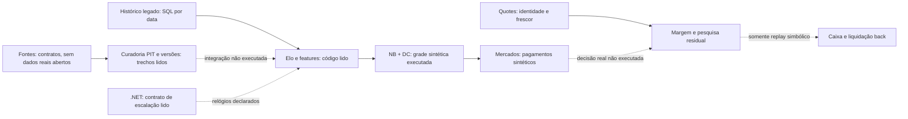

# Baseline factual — OSR-20260911-01

Modo: RESEARCH_AND_BENCHMARK. Beneficiário: brasileirao-predictor. Inspeção consolidada em 2026-09-11T03:28:38.651521+00:00. [Fotografia inicial](baseline_snapshot.json) preservada sem reescrita; sua marca de inspeção pendente corresponde ao início, não ao relatório final. [Registro estruturado](registry.json) contém a cobertura posterior e hashes dos arquivos.

## Identidade e ambiente

- Checkout: `C:/BRASILEIRAO/brasileirao-predictor`, branch `main`, SHA `d9584af6deeec701cf8989349f22ab7e4b398249`; `git ls-remote` confirmou o mesmo HEAD remoto no início. Checkout inicialmente limpo. Não houve reset, stash, commit, push ou merge.
- Python declarado: >=3.13,<3.15; `predictor-core` 3.2.0 e `predictor-ops` 4.1.0 declarados no lock. Imports de core em contratos/telemetria/bootstrap foram localizados, mas execução e uso real completo de ops não foram demonstrados.
- A `.venv` operacional não estava disponível. A venv histórica de publicação tinha Python 3.13, porém numpy não estava importável no probe. Isso descreve aquele ambiente, não invalida o CI antigo.
- Os benchmarks usaram **venv nova e isolada de dependências** em `C:/BRASILEIRAO/work/open-source-research-OSR-20260911-01`, Python 3.13.12, numpy 2.2.6 e scipy 1.15.3. Python global, locks e serviços ficaram intactos. Limites de isolamento do processo estão em [EXPERIMENTS](EXPERIMENTS.md).

## Autoridade e preservação

Foram lidos os pontos de entrada README, HANDOFF, ESTADO_ATUAL, INDICE_DOCUMENTACAO, DATA_MAP, documentos de publicação de 10/09/2026, contratos RES e instruções externas em `C:/BRASILEIRAO/LEIA_PRIMEIRO.md` e `INSTRUCOES/PROXIMO_PROMPT_APOS_PUBLICACAO_2026-09-10.md`. Não foi localizado AGENTS.md nos pontos pesquisados. Instruções locais limitaram o trabalho a um agente.

[PROTECTED_PATHS.txt](PROTECTED_PATHS.txt) é inventário conservador por **nomes**, acrescido de todos os stores privados e resultados das coortes H14/H15/H9/A1 e estudos BE. Não autoriza leitura de resultados. Não foram executados pytest global, CI global, discovery de testes, avaliadores oficiais, liquidação de coortes ou comandos de reabertura. Contratos/metadados permitidos foram separados de desfechos. Bancos, Redis e serviços .NET não foram iniciados, restaurados ou consultados para benchmark.

O plano DC existente foi preservado: fixture `1000032566887012`, cutoff `2026-09-11T23:00:00Z`, kickoff planejado `2026-09-12T00:00:00Z`, captura `22:58:30Z`, janela helper `22:55–22:59:15Z`; máximo de uma chamada odds e duas account, reserva 20 da quota gratuita 250 e mínimo 21, sem retries. Estes são **metadados de proteção**, não confirmação de captura realizada. Automação `completar-dados-do-brasileir-o` e task `01a08756-2962-7c43-9773-c790cc81329d` não foram alteradas. Nenhuma consulta de quota OddsPapi nesta rodada.

## Fluxos rastreados e limites

As setas sólidas resumem dependências vistas em código, não um replay operacional end-to-end. A integração entre caminhos legado/PIT, filas Python/Redis/.NET e decisões efetivas continua não executada. `predict.py` foi examinado parcialmente; não se atribui C4 ao serviço inteiro por executar uma função copiada.

| Caminho fixado no HEAD | Leitura | C (escopo) | Observação |
| --- | --- | --- | --- |
| [brasileirao_predictor/model.py](https://github.com/leonardosovienski/brasileirao-predictor/blob/d9584af6deeec701cf8989349f22ab7e4b398249/brasileirao_predictor/model.py) | completo | C4 | NB + ligação Elo, normalizador DC, fitting lido; somente grade fixa executada em T01. |
| [brasileirao_predictor/market_pricer.py](https://github.com/leonardosovienski/brasileirao-predictor/blob/d9584af6deeec701cf8989349f22ab7e4b398249/brasileirao_predictor/market_pricer.py) | completo | C4 | 1X2, dupla chance, BTTS, placar, DNB, totais inteiros/meios e AH quarto; T03 não testa todos os domínios inválidos. |
| [brasileirao_predictor/dixon_coles.py](https://github.com/leonardosovienski/brasileirao-predictor/blob/d9584af6deeec701cf8989349f22ab7e4b398249/brasileirao_predictor/dixon_coles.py) | completo | C1 | Controle Poisson/DC; MLE não executado. |
| [brasileirao_predictor/math_utils.py](https://github.com/leonardosovienski/brasileirao-predictor/blob/d9584af6deeec701cf8989349f22ab7e4b398249/brasileirao_predictor/math_utils.py) | completo | C4 | Shin, fallback proporcional; T02. |
| [brasileirao_predictor/ratings.py](https://github.com/leonardosovienski/brasileirao-predictor/blob/d9584af6deeec701cf8989349f22ab7e4b398249/brasileirao_predictor/ratings.py) | completo | C1 | Elo temporal; batching por data quando falta kickoff e mando neutro. |
| [brasileirao_predictor/feature_builder.py](https://github.com/leonardosovienski/brasileirao-predictor/blob/d9584af6deeec701cf8989349f22ab7e4b398249/brasileirao_predictor/feature_builder.py) | completo | C1 | SQL read-only por data anterior e xG ausente explícito; não prova publication/receipt PIT. |
| [brasileirao_predictor/predict.py](https://github.com/leonardosovienski/brasileirao-predictor/blob/d9584af6deeec701cf8989349f22ab7e4b398249/brasileirao_predictor/predict.py) | 1–65 e busca de símbolos/consumidores | C1 | Cache read-only e fallback em memória; caminho end-to-end não executado. |
| [brasileirao_predictor/research/structural_edge.py](https://github.com/leonardosovienski/brasileirao-predictor/blob/d9584af6deeec701cf8989349f22ab7e4b398249/brasileirao_predictor/research/structural_edge.py) | completo | C4 | Quotes imutáveis, frescor, identidade, power; somente power executado. |
| [brasileirao_predictor/research/score_metrics.py](https://github.com/leonardosovienski/brasileirao-predictor/blob/d9584af6deeec701cf8989349f22ab7e4b398249/brasileirao_predictor/research/score_metrics.py) | completo | C1 | Brier soma, clipping log loss; DM quadratiza entradas, requer convenção de erro explícita. |
| [brasileirao_predictor/research/shadow_portfolio.py](https://github.com/leonardosovienski/brasileirao-predictor/blob/d9584af6deeec701cf8989349f22ab7e4b398249/brasileirao_predictor/research/shadow_portfolio.py) | completo | C4 | Caixa back binário, reserva e desempate event_id; não prova fills/lay/multi-market por partida. |
| [brasileirao_predictor/research/residual_walkforward.py](https://github.com/leonardosovienski/brasileirao-predictor/blob/d9584af6deeec701cf8989349f22ab7e4b398249/brasileirao_predictor/research/residual_walkforward.py) | 1–180 | C1 | Clocks condicionais; campos ausentes não são todos bloqueados neste caminho diagnóstico. |
| [brasileirao_predictor/data/pit_backfill.py](https://github.com/leonardosovienski/brasileirao-predictor/blob/d9584af6deeec701cf8989349f22ab7e4b398249/brasileirao_predictor/data/pit_backfill.py) | 367–460; 537–573 | C1 | Curadoria, versões e evaluation_view; nenhuma base aberta ou escrita. |
| [brasileirao_predictor/ecosystem_plugin.py](https://github.com/leonardosovienski/brasileirao-predictor/blob/d9584af6deeec701cf8989349f22ab7e4b398249/brasileirao_predictor/ecosystem_plugin.py) | completo | C1 | Metadados WAITING/UNKNOWN/NOT_VALIDATED; não comprova execução do ecossistema. |
| [brasileirao_predictor/research/pit_features/contextual.py](https://github.com/leonardosovienski/brasileirao-predictor/blob/d9584af6deeec701cf8989349f22ab7e4b398249/brasileirao_predictor/research/pit_features/contextual.py) | completo | C1 | Descanso, viagem, superfície e técnico com contrato de evidência. |
| [brasileirao_predictor/dynamic_strength.py](https://github.com/leonardosovienski/brasileirao-predictor/blob/d9584af6deeec701cf8989349f22ab7e4b398249/brasileirao_predictor/dynamic_strength.py) | completo | C1 | Força residual curta/longa; eficácia não executada. |
| [dotnet/LineupWorker/Models/LineupModelInputs.cs](https://github.com/leonardosovienski/brasileirao-predictor/blob/d9584af6deeec701cf8989349f22ab7e4b398249/dotnet/LineupWorker/Models/LineupModelInputs.cs) | completo | C1 | Cadeia de clocks declarados e hashes de VORP; autenticidade do provedor não provada. |
| [tests/test_resolution_structural_edge.py](https://github.com/leonardosovienski/brasileirao-predictor/blob/d9584af6deeec701cf8989349f22ab7e4b398249/tests/test_resolution_structural_edge.py) | completo | C2 | Stale, política inválida, imutabilidade, bracket power; somente lidos. |
| [tests/test_completion_math_consumer.py](https://github.com/leonardosovienski/brasileirao-predictor/blob/d9584af6deeec701cf8989349f22ab7e4b398249/tests/test_completion_math_consumer.py) | completo | C2 | Grades/linhas e coerência NB; somente lidos. |
| [tests/test_resolution_curated_versions.py](https://github.com/leonardosovienski/brasileirao-predictor/blob/d9584af6deeec701cf8989349f22ab7e4b398249/tests/test_resolution_curated_versions.py) | 1–85 | C2 | Roundtrip/status/conflitos/suspended; somente lidos. |
| [.github/workflows/publication-validation.yml](https://github.com/leonardosovienski/brasileirao-predictor/blob/d9584af6deeec701cf8989349f22ab7e4b398249/.github/workflows/publication-validation.yml) | 1–85 | C0 | Escopo do workflow lido, não executado. |
| [tools/publication_validation/scope.json](https://github.com/leonardosovienski/brasileirao-predictor/blob/d9584af6deeec701cf8989349f22ab7e4b398249/tools/publication_validation/scope.json) | completo | C0 | Allowlist documental lida; nenhuma coleta pytest. |
| [pyproject.toml](https://github.com/leonardosovienski/brasileirao-predictor/blob/d9584af6deeec701cf8989349f22ab7e4b398249/pyproject.toml) | dependências e metadados | C0 | Python >=3.13,<3.15; dependência declarada não é uso executado. |

## Estado por capacidade

| ID | Capacidade | Estado interno | Evidência | Limite principal |
| --- | --- | --- | --- | --- |
| K01 | Massa de cauda e suporte adaptativo | PARCIAL | C4 | A distribuição normalizada omite massa mensurável em T01; falta diagnóstico no retorno atual. |
| K02 | Admissibilidade temporal e identidade com testes adversariais | PARCIAL | C2 | Feature legado corta por data do jogo, enquanto contratos PIT novos têm mais relógios; não confundir caminhos. |
| K03 | Adapter estrito e diferencial de retirada de margem | IMPLEMENTADO | C4 | T02 concorda no domínio usual e encontra falhas externas nas bordas; manter política local explícita. |
| K04 | Scoring, empate, calibração e convenções | PARCIAL | C2 | Brier local soma classes; referência binária usa outro eixo. DM local eleva entradas ao quadrado. |
| K05 | Pagamentos, caixa e exposição por partida | PARCIAL | C4 | T03 passa para pagamentos atômicos e caixa back; simulador rejeita event_id repetido e não cobre lay/fills. |
| K06 | Força dinâmica, pooling e controles de gols | EXPERIMENTAL | C1 | NB/Elo e ajuste dinâmico já existem; trocar família sem dados/controle igual não isola ganho. |
| K07 | Contexto, elenco e qualidade de chances anteriores | EXPERIMENTAL | C1 | Descanso/viagem/técnico e envelopes de escalação já têm código; fatos PIT por jogador não demonstrados. |
| K08 | Matriz de fontes e recibos por campo/mercado | PARCIAL | C1 | Histórico de preço e API atual não garantem aceitação, publicação ou ingestão no cutoff. |
| K09 | Eventos e tracking: coordenadas, xT/VAEP e pressão | DESCONHECIDO | C0 | Nenhuma cobertura brasileira admissível foi comprovada. Código externo útil, mas upstream e task não são equivalentes. |
| K10 | Diagnósticos e registro de experimentos | PARCIAL | C1 | Registro em arquivos atende a rodada; novo servidor de tracking ou dashboard não tem necessidade comprovada. |
| K11 | Challengers tabulares e modelos complexos | DESCONHECIDO | C0 | Não há ganho preditivo comprovado nesta rodada; múltiplos READMEs são alegações. Compressão evita campeonato de algoritmos. |
| K12 | Ganho esportivo incremental além do preço | EXPERIMENTAL | C1 | Código residual existe, mas nenhuma coorte econômica nova admissível foi usada; relação com famílias BE exige revisão. |

`DESCONHECIDO` significa que a inspeção delimitada não estabeleceu presença/ausência. Não possuir tracking, live betting ou mais redes neurais não é defeito demonstrado. Ratings, força dinâmica e features contextuais já existem: a proposta é validar e completar dados, não reinventar esses módulos.

## CI, testes, dados e conclusão

O recibo local `docs/continuation/publication_2026-09-10/evidence/ci-34552247397/summary.json` informa sucesso do workflow [34552247397](https://github.com/leonardosovienski/brasileirao-predictor/actions/runs/34552247397), sobre SHA `cc38b57bd3ba6f8c2cbdce6353eaf085d4ece14f`. É **evidência documental histórica**, sem reexecução ou verificação online deste CI nesta rodada, e não certifica automaticamente o HEAD atual. Os números 345 Python por versão e 160 .NET pertencem à publicação anterior; não são testes nossos nem amostras científicas independentes.

Históricos privados de FootballData 2012–2024 e quotes OddsPapi tardios citados nos contratos não foram abertos. Cobertura materializada, aceitação, limites, custos, dados prospectivos maturados e estado efetivo das filas permanecem NOT_ACCESSED/NOT_VERIFIED. Não se inferiu admissibilidade pela existência de hashes ou arquivos.

- ENGINEERING_STATUS: três ensaios determinísticos de engenharia concluídos; homologação operacional não avaliada.
- DATA_ADMISSIBILITY: apenas dados sintéticos admitidos para execução desta rodada; dados reais para novo estudo não demonstrados.
- PREDICTIVE_EVIDENCE: NOT_EVALUATED nesta rodada.
- ECONOMIC_EVIDENCE: NOT_EVALUATED nesta rodada; capital continua proibido.

O defeito observável é diagnóstico insuficiente de cauda no domínio testado. Não há base para declarar que ele é a maior causa de erro real, que empates são a falha principal ou que melhorar uma métrica produzirá ganho econômico.
